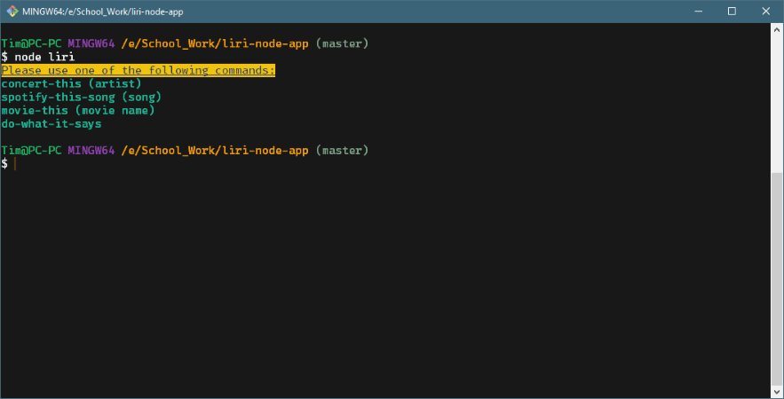
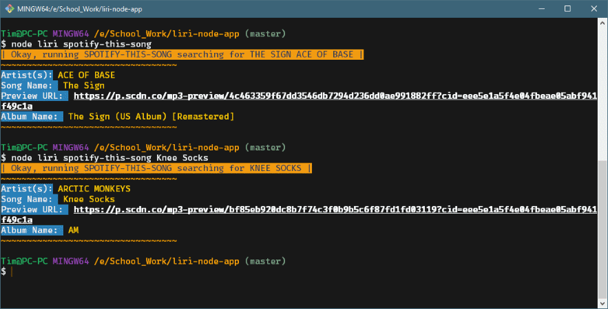

# liri-node-app
___

## Check this out!

#####This node program will let you search for artists upcoming shows showing where they will be next and what date.
#####Another function lets you search for a song using spotifys API to get song and artist information.
#####Third thing we'll let you do is look up a movie and get info for the movie including title, year, plot, and MORE!

#####Last, but not least we have a command that will read from a text file and get one of the first three commands entered in the text file along with artist, song, or movie.

___

### For starters...

##### This is what will show up if you dont put a command or type something other than one of the working commands.

___

### So here's the ol' concert-this command:

##### First thing you'll see is that if no artist is entered in after the command then it will ask you to add an artist to the command.

##### Next section shows the information when the band Arctic Monkeys(one of my favorites) are typed after the command.
___

### Now we're getting somewhere... spotify-this-song

##### First thing you will see here is that if there is no song input after the comand it will default to "The Sign" by Ace of Base.

##### Then with Arctic Monkeys song "Knee Socks" entered it will show that songs information.
___

### Alright, who likes movies? movie-this:

##### Okay top command shows that with no movie entered into the argument then it will default to looking up Mr. Nobody and display its information.

##### Second thing shows information for the movie I input which is Hot Fuzz. One of my favorite movies.

___
### ALMOST DONE... do-what-it-says

##### When do-what-it-says is entered it will read from the random.txt file and uses the command by seperating it from the input using the comma as separator.

##### It then runs the function called by the command and uses the input into that function.

___

### To use yourself you'll need to get a Spotify API key and an OMDB API key. These will need to be put in a .env file:

#### This will allow them to be imported into the keys.js file. Then that will be required in the liri.js file.

___

## Hopefully you've followed along well and enjoy this little node app i've created. Thanks for checking it out!